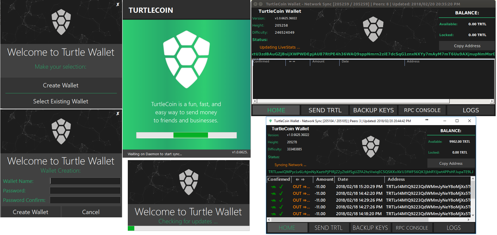

# bitcoin nova Wallet .NET

bitcoin nova Wallet written in C# for windows and linux through Mono.

# Download and Running

Check here for the latest release: 
https://github.com/bitcoin nova/desktop-xamarin/releases

After downloading extract and run the BitcoinnovaWallet-GUI.exe

# Like the project and want to send some BTN? Why thank you!
Please instead, donate the amount to our "Rain Bot" in our Discord!

# In progress

The wallet is stable enough to run the release fine, however development is in progress. You may download the release archive or compile yourself

# future

This repo will later be switched from winforms and C# to Xamarin to run cross-platform on more devices.
